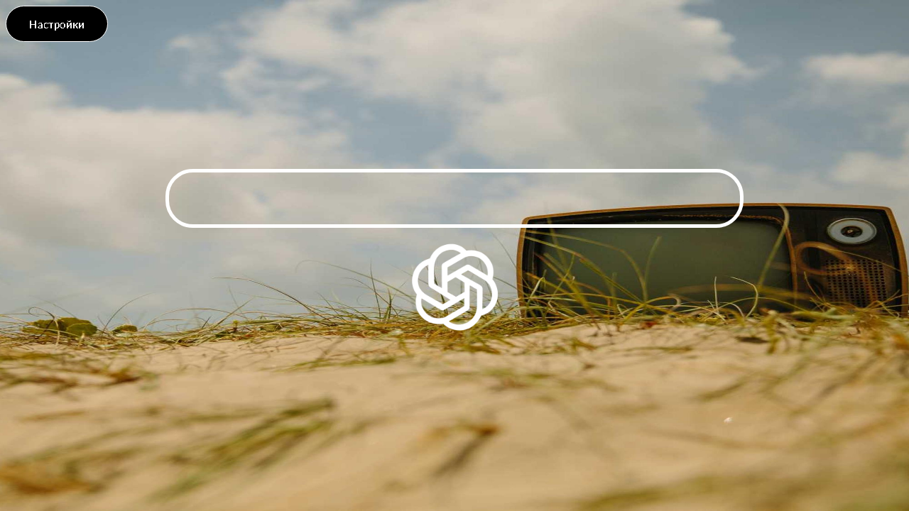

# Peafis - Поисковик будущего

**p** - practical (практичный)

**e** - evolving (развивающийся)

**a** - available (доступный)

**f** - fast (быстрый)

**i** - innovative (инновационный)

**s** - simplified (упрощенный)

Минималистичная стартовая страница с быстрым поиском, погодой и системой скрытых меток.

## Возможности

- Поиск через Google, Yandex, Bing, DuckDuckGo, Perplexity
- Быстрый доступ к ChatGPT
- Виджет погоды для 200+ городов
- Кастомные обои (импорт/экспорт/случайные)
- Система скрытых меток для быстрого доступа к ссылкам

## Скриншоты

### Меню и настройки

| Меню | Настройки |
|:----:|:---------:|
|  |  |

## Скрытые метки

Создавайте интерактивные ссылки в любом месте экрана.

### Управление

| Действие | ПК | Телефон |
|----------|:--:|:-------:|
| Режим меток | Клик колёсиком | Тап двумя пальцами |
| Создать метку | Долгий клик (500мс) | Долгий тап (250мс) |
| Открыть ссылку | Клик | Тап |
| Контекстное меню | ПКМ / долгий клик | Долгий тап |

### Видео-демонстрация

| Телефон | ПК |
|:-------:|:--:|
|  |  |

## Командная строка (ТЫК)

| Команда | Описание |
|---------|----------|
| `list` | Показать сохранённые ссылки |
| `copy` | Скопировать в буфер |
| `ключ url` | Добавить ссылку |
| `delete ключ` | Удалить ссылку |
| `clearAll` | Очистить все |

## Технологии

HTML5 / CSS3 / JavaScript